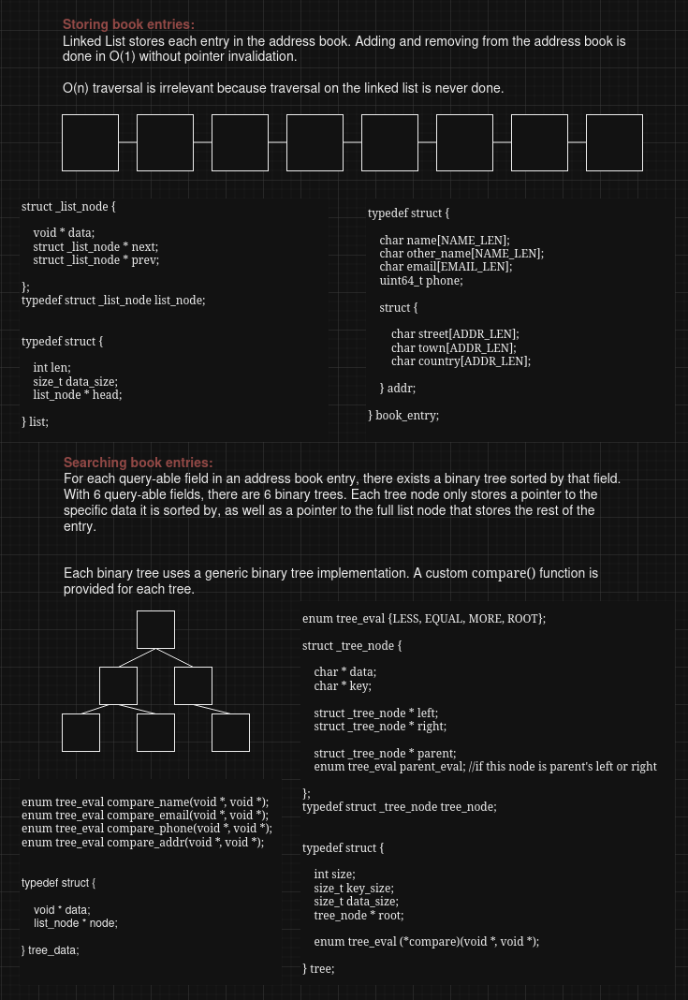
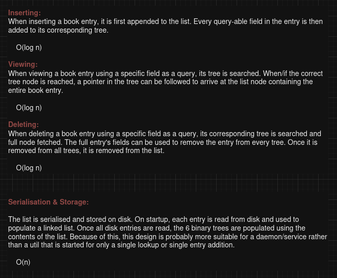

    

    

### Notes

I spent just under 2 hours extracting lists & a half finished RB-tree implementation I wrote into 
this project, converting the unfinished RB tree into a fully finished binary tree in the process.

By the time I came to writing the UI, I had written over 1300 lines in 4 hours. I severely 
underestimated the amount of time the UI will take (in part because the only UI I ever write is 
`getopt_long()` clones). Writing UI in C seems like misuse of the language, and given that I did 
run out of time, I am quite happy that the poorly implemented part is the UI and not the core of 
the program.

In retrospect, had I chosen C++ and used std::map as I originally inteded to, I probably would 
have finished on time.

Regarding the design itself, besides using binary trees instead of RB or AVL trees, I think it was 
very good and I am very happy with it. 

If I had more time, I would just focus on finishing the design, debugging and testing it. Maybe 
finishing that RB-tree and using it instead. If I had subtantially more time, I'd probably look at 
some way to serialise the trees to speed up startup time.
